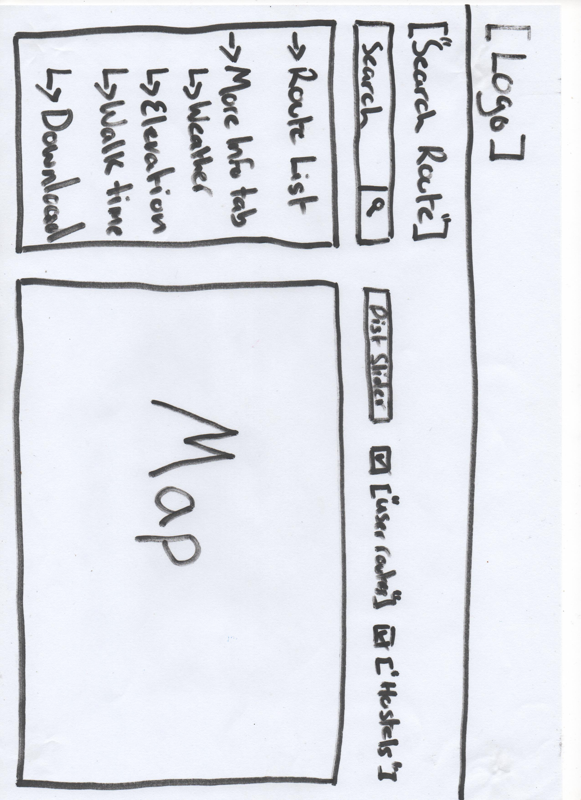
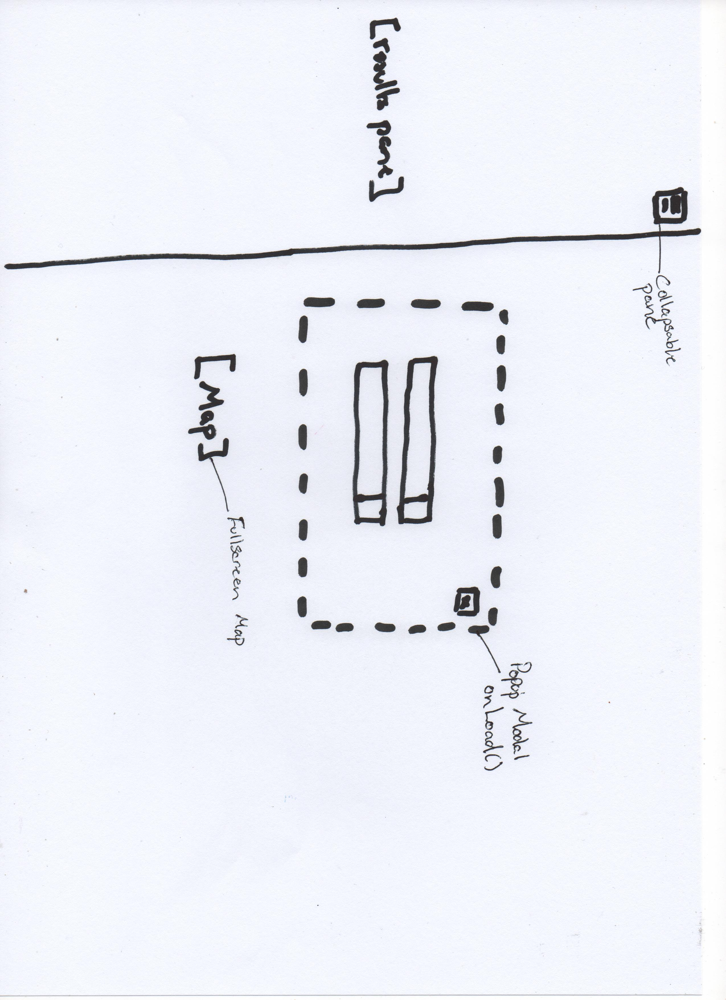
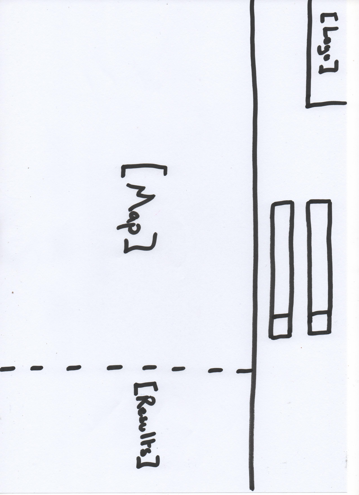
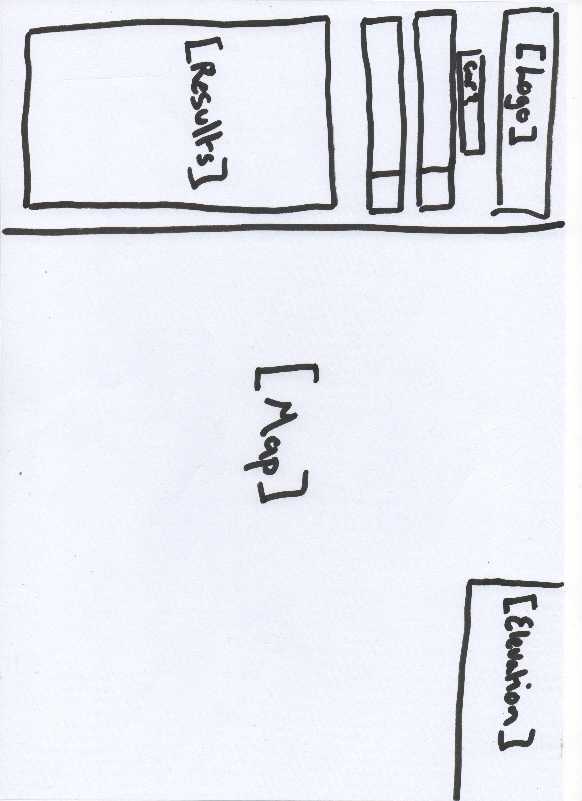
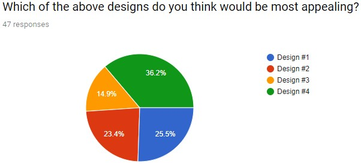
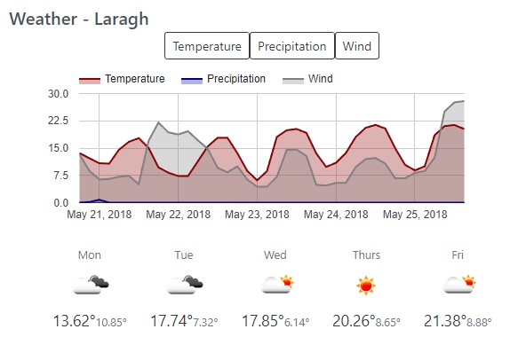
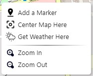
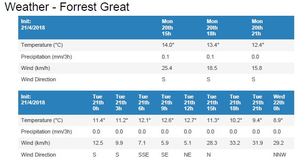
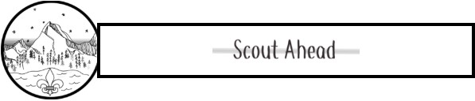

# Blog: Scout Ahead

**Finnian O'Neill**

## My First Blog Entry

I spent this week researching different layouts for my website. I came up with four different designs, I plan to do a survey to ask users which design they think would be best. 






This week I also did out the inital code wireframe so I would have some structure in place for when I begin devolpment.

## My Second Blog Entry

I got 47 responses to my design survey with 36% of people favouring Design number 4. Although the designs were relatively evenly distributed I still feel design four will be a good design as it is a standard design for websites with maps and as such users should be more comfortable using my website.



## My Third Blog Entry

Today I created the inital wireframe of my index.html, I have yet to decide on a logo and color scheme for the website so I will leave the styling til a later date. 

I also spent a significant amount of time this week researching how to use Openlayers, there are quite a few working examples on their website but none show or explain how to interact with the map to be able to display points so I can overlay my own data.

## My Fourth Blog Entry

I now have the basic map with a search, currently I don't know how to parse the json results as all examples I have found are not working for my responseData. All the results are being displayed as console output for now until I figure out how to parse correctly.

## My Fifth Blog Entry

I figured how to parse data, I found it was easiest to work with XML over JSON so I changed the responsetype to XML. Search Results are now being displayed with the location name, latittude and longitude. The result ranking attribute is called importance in the Nominatim api.

Search Function:
```
httpGetAsync(url, function(urlThingy){
    var xmlDoc = $.parseXML( urlThingy ),
    $xml = $( xmlDoc ),
    $place = $xml.find('place');
    $place.each(function(index, element) {
        if(element.attributes["importance"]){

            //Get the Name, Lat, Long, Importance(ranking) and type of each location.
            var placeName = element.attributes["display_name"].value;
            var importance = element.attributes["importance"].value;
            var lat = element.attributes["lat"].value;
            var lon = element.attributes["lon"].value;
            var type = element.attributes["type"].value;

            // Add each result to the list.
            addResult(placeName, index, lat, lon, type, startFinish);
        }
    })
});
```

## My Fifth Blog Entry

I created a new branchs for GPX, Routing and Weather. I spent a large amount of time researching the different options for routing api's. I decided on using Mapquest as it had the largest amount of requests per month for a free account. 

I was able to get the routing working using Mapquest and I'm parsing the results correctly. That means that you can now search for a start location and a finish location and after selecting your finish location it will get the directions between the two locations.

Function for adding the directions to the list:
```
// Function to add a direction to the list.
function addRouteResult(directions, dist, lat, lon, time){
    var resultList = document.getElementById('resultCard');

    var headingLink = document.createElement('a');
    headingLink.setAttribute('href', '#');
    headingLink.setAttribute('class', 'list-group-item list-group-item-action flex-column align-items-start');
    headingLink.setAttribute('onclick', "pan("+lat+","+lon+",15)");

    var headingDiv = document.createElement('div');
    headingDiv.setAttribute('class', 'd-flex w-100 justify-content-between');

    var headingH5 = document.createElement('h5');
    headingH5.setAttribute('class', 'mb-1');

    var headingName = document.createTextNode(directions);
    var headingDist = document.createElement('small');
    var headingDistValue = document.createTextNode(dist + " Km");

    var latLong = document.createElement('small');
    latLong.setAttribute('class', 'text-muted col-6');
    var latLongText = document.createTextNode("Lat:"+lat+"\tLon:"+lon);

    var timeDiv = document.createElement('small');
    timeDiv.setAttribute('class', 'text-muted col-6');
    var timeText = document.createTextNode("Time: "+time);

    headingDist.appendChild(headingDistValue);
    headingH5.appendChild(headingName);
    latLong.appendChild(latLongText);
    timeDiv.appendChild(timeText);
    headingDiv.appendChild(headingH5);
    headingDiv.appendChild(headingDist);
    headingLink.appendChild(headingDiv);
    headingLink.appendChild(latLong);
    headingLink.appendChild(timeDiv);
    resultList.appendChild(headingLink);
}
```

The directions are being displayed in the same way as the search results, but I don't know how to take the lat and long positions of a route and display them on the map.

Sample Route Response XML:
```
<response>
    <info>
        <statusCode>0</statusCode>
        <messages/>
        <copyright>
            <imageUrl>http://api.mqcdn.com/res/mqlogo.gif</imageUrl>
            <imageAltText>© 2018 MapQuest, Inc.</imageAltText>
            <text>© 2018 MapQuest, Inc.</text>
        </copyright>
    </info>
    <routeError>
        <errorCode>-400</errorCode>
        <message/>
    </routeError>
    <route>
        <sessionId>5b01cca2-0386-4ee4-02b4-2339-0e10b2c42bb2</sessionId>
        <options>
            <shapeFormat>raw</shapeFormat>
            <generalize>-1.0</generalize>
            <maxLinkId>0</maxLinkId>
            <narrativeType>text</narrativeType>
            <stateBoundaryDisplay>true</stateBoundaryDisplay>
            <countryBoundaryDisplay>true</countryBoundaryDisplay>
            <sideOfStreetDisplay>true</sideOfStreetDisplay>
            <destinationManeuverDisplay>true</destinationManeuverDisplay>
            <avoidTimedConditions>false</avoidTimedConditions>
            <enhancedNarrative>false</enhancedNarrative>
            <returnLinkDirections>false</returnLinkDirections>
            <timeType>0</timeType>
            <routeType>PEDESTRIAN</routeType>
            <locale>en_US</locale>
            <unit>M</unit>
            <tryAvoidLinkIds/>
            <mustAvoidLinkIds/>
            <manmaps>true</manmaps>
            <drivingStyle>2</drivingStyle>
            <highwayEfficiency>22.0</highwayEfficiency>
            <useTraffic>false</useTraffic>
        </options>
    <boundingBox>
        <ul>
            <lat>52.99884</lat>
            <lng>-6.332633</lng>
        </ul>
        <lr>
            <lat>52.994117</lat>
            <lng>-6.315175</lng>
        </lr>
    </boundingBox>
        <distance>2.1</distance>
        <time>3024</time>
        <realTime>-1</realTime>
        <fuelUsed>0.0</fuelUsed>
        <formattedTime>00:50:24</formattedTime>
        <legs>
        <leg>
        <distance>2.1</distance>
        <time>3024</time>
        <formattedTime>00:50:24</formattedTime>
        <index>0</index>
    <maneuvers>
        <maneuver>
            <startPoint>
                <lat>52.9942</lat>
                <lng>-6.3195</lng>
            </startPoint>
            <maneuverNotes/>
            <distance>0.183</distance>
            <time>264</time>
            <formattedTime>00:04:24</formattedTime>
            <attributes>2</attributes>
            <turnType>0</turnType>
            <direction>8</direction>
            <narrative>Start out going east (Portions unpaved).</narrative>
            <directionName>East</directionName>
            <index>0</index>
            <streets/>
            <signs/>
            <iconUrl>
            <![CDATA[
            http://content.mapquest.com/mqsite/turnsigns/rs_straight_sm.gif
            ]]>
            </iconUrl>
            <linkIds/>
            <mapUrl>
            <![CDATA[
            http://open.mapquestapi.com/staticmap/v5/map?key=ugu40KSfOnVGSAEm4EZGuwm8vsxyzROR&size=225,160&locations=52.99422,-6.319476|marker-2||52.994116999999996,-6.315175|marker-3||&center=52.9941685,-6.3173255&defaultMarker=none&zoom=12&rand=555377518&session=5b01cca2-0386-4ee4-02b4-2339-0e10b2c42bb2
            ]]>
            </mapUrl>
        </maneuver>
    </route>
</response>
```

## My Sixth Blog Entry

Trying multiple methods for GPX upload, doing a simple upload seems managable but allowing a secure upload of a non standard file type looks like it will require me to write my own script to validate the file and ensure that it is not malicous. I would then have to change the name of the uploaded file to prevent directory traversal attacks on the server. I would also ideally have to then have a seperate server that hosts all the uploaded files so scripts can not be run on my server. This type of upload will require me to write a proxy script. I am going to put the GPX upload to one side for now as I haven't a need to setup a server just yet so I will wait til later in the project before attempting this.

I also tried another solution to display points on the map with no luck. I also realised that the Route Response only gives the positions of where the turns/directions are which means it's missing all the positions inbetween those points. I will have to find out a way of getting these points as otherwise I will have straight lines showing on windy roads.

## My Seventh Blog Entry

I updated the styles for the result lists to a more modern look. I also have finally got routes displaying on the map. MapQuest has another call named Route Shape. This returns a shapeFile for the given route, it uses the sessionId that is given when requesting a route between two locations. This session is only valid for 30mins. 

Sample Route Shape Response:
```
<?xml version="1.0" encoding="UTF-8"?>
<response>
    <info>
        <statusCode>0</statusCode>
        <messages/>
        <copyright>
            <imageUrl>http://api.mqcdn.com/res/mqlogo.gif</imageUrl>
            <imageAltText>© 2018 MapQuest, Inc.</imageAltText>
            <text>© 2018 MapQuest, Inc.</text>
        </copyright>
    </info>
    <routeError>
        <errorCode>-400</errorCode>
        <message></message>
    </routeError>
    <route>
        <options>
            <shapeFormat>raw</shapeFormat>
            <generalize>-1.0</generalize>
            <maxLinkId>0</maxLinkId>
            <narrativeType>text</narrativeType>
            <stateBoundaryDisplay>true</stateBoundaryDisplay>
            <countryBoundaryDisplay>true</countryBoundaryDisplay>
            <sideOfStreetDisplay>true</sideOfStreetDisplay>
            <destinationManeuverDisplay>true</destinationManeuverDisplay>
            <avoidTimedConditions>false</avoidTimedConditions>
            <enhancedNarrative>false</enhancedNarrative>
            <returnLinkDirections>false</returnLinkDirections>
            <timeType>0</timeType>
            <routeType>FASTEST</routeType>
            <locale>en_US</locale>
            <unit>M</unit>
            <tryAvoidLinkIds></tryAvoidLinkIds>
            <mustAvoidLinkIds></mustAvoidLinkIds>
            <manmaps>true</manmaps>
            <drivingStyle>2</drivingStyle>
            <highwayEfficiency>22.0</highwayEfficiency>
            <useTraffic>false</useTraffic>
        </options>
        <boundingBox>
            <ul>
                <lat>40.798587</lat>
                <lng>-77.793266</lng>
            </ul>
            <lr>
                <lat>40.203571</lat>
                <lng>-76.729667</lng>
            </lr>
        </boundingBox>
        <shape>
            <shapePoints>
                <latLng>
                    <lat>40.203735</lat>
                    <lng>-76.729667</lng>
                </latLng>
                <latLng>
                    <lat>40.203617</lat>
                    <lng>-76.729705</lng>
                </latLng>
                <latLng>
                    <lat>40.301498</lat>
                    <lng>-76.872665</lng>
                </latLng>
                <latLng>
                    <lat>40.364498</lat>
                    <lng>-76.92881</lng>
                </latLng>
                <latLng>
                    <lat>40.368495</lat>
                    <lng>-76.981414</lng>
                </latLng>
                <latLng>
                    <lat>40.382682</lat>
                    <lng>-77.016967</lng>
                </latLng>
            </shapePoints>
        </shape>
    </route>
</response>
```

Using this shapeFile I can now draw the route on the map. I have defined the styles for the different type of lines and polygons in map.js and in routes.js I get the shapeFile, transform the data to positions on my map, draw a line between each point, find out the size of my map and determine what zoom level to be at then lastly display the route on the map as a new Vector layer.

```
httpGetAsync(url, function(urlThingy){  
        var xmlDoc = new DOMParser().parseFromString(urlThingy,"text/xml");
        shapePoints = xmlDoc.getElementsByTagName("latLng");
        
        // Get all the points of the route.
        var routePoints = [];

        for (var i = 0; i < shapePoints.length; i++) {

            var tmp = [];
            tmp.push(parseFloat(shapePoints[i].childNodes[1].childNodes[0].nodeValue));
            tmp.push(parseFloat(shapePoints[i].childNodes[0].childNodes[0].nodeValue));
            routePoints[i] = tmp;
        }

        var newGeoObj = {};
        newGeoObj["type"] = "LineString";
        newGeoObj["coordinates"] = routePoints;

        //Transform the points to points on our map.
        routeGeom = new ol.geom.LineString(newGeoObj.coordinates).transform('EPSG:4326','EPSG:3857');
        routeFeature = new ol.Feature({
            geometry:routeGeom
        })

        //Determine what zoom level should be.
        extentToZoom = routeGeom.getExtent();

        //Add the route points to the vector layer
        vectorSource = new ol.source.Vector({
            features: [routeFeature]
        });

        //Initiate the route as a new vector layer.
        vectorLayer = new ol.layer.Vector({
            source: vectorSource,
            style: styleFunction
        });

        //Add the route as a new layer and display it.
        map.addLayer(vectorLayer);  
        map.getView().fit(extentToZoom,map.getSize());
    });
}
```

## My Eight Blog Entry

I spent this week getting the weather information displayed correctly. I am using google charts to draw an area chart to show the wind, rain and temperature. 

My solution for have a button for each day is not very elegant but it was the only solution I could get working as I was having problems with types when I passed certain objects in as parameters. 



## My Ninth Blog Entry

This week I worked on getting a context menu working on the map so users can right click and drop a pin for start and finish locations. I also added an option to get the weather for location you clicked. I think this addition is a good quality of life improvement as it makes using the map much easier and faster.



## My Tenth Blog Entry

This week I worked on all the downloadable parts of the website, I created a script to create GPX files using the ShapeFile we get after searching for a route. 

I also started using the open-elevation api to get the elevation at each location in the ShapeFile, I then added this data to the GPX file and also used it to create an elevation profile of the route. 

Lastly I wanted users to be able to easily download the weather information from the website so I created a new script called printWeather.js which uses a library called jsToPdf. This enables me to create a simple downloadable PDF of the weather information we collect from OpenWeatherMap and show all the details of the weather. 

The weather PDF gives a 5-day forecast for the given aren and gives in-depth information for every 3 hours of each day.



## My Eleventh Blog Entry

Today I designed a logo for Scout Ahead and with the colors used in my logo I kept them very simple and left it with black and white. I wanted to use colors that contrasted well so I wouldn't have any issues with users who have impaired vision. 



Also when I was designing my logo I wanted something that had a similar style to a badge that would be worn on a scout uniform. This meant it needed to be simple and have a pin style layout. 

Lastly I then updated all the styles for the website to be consistant with the color scheme of the logo. 

## My Twelfth Blog Entry

Today while testing I noticed that my GPX download and Elevation profile were not displaying. After further investigation I narrowed it down and found that although I was getting valid route information from mapquest, I would get the sessionId and pass it into the route shape call. I would get an error response from mapquest servers saying that my session has expired even though it was just created. 

I notified mapquest of the issues and they are investigating but it seems that none of the route shape calls are working correctly and as a result neither is my gpx and elevation profile.

Session Expired Error:
```
<response>
    <info>
        <statusCode>601</statusCode>
        <messages>
            <message>
                Could not retrieve route from session. The most likely cause is that the session has expired.
            </message>
        </messages>
        <copyright>
            <imageUrl>http://api.mqcdn.com/res/mqlogo.gif</imageUrl>
            <imageAltText>© 2018 MapQuest, Inc.</imageAltText>
            <text>© 2018 MapQuest, Inc.</text>
        </copyright>
    </info>
    <routeError>
        <errorCode>201</errorCode>
        <message/>
    </routeError>
    <route/>
</response>
```
